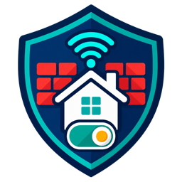

<p align="center">
  
</p>

# FortiAP Presence Tracker for Home Assistant

A local Home Assistant integration for selected FortiAP Wi-Fi clients and verified FortiGate firewall-policy switches.

The two features are independent. Use presence only, policy switches only, or connect them with normal Home Assistant automations.

## Features

- selected-client discovery without creating entities for every network device
- `device_tracker` and presence `binary_sensor` entities
- multi-device people for a phone, watch, tablet, or other tracked devices
- conservative away timeout and correct FortiAP roaming behavior
- persistent first seen, last seen, connection, and network metadata
- optional new-device event, unknown-device sensor, and client-count sensor
- one verified switch per configured FortiGate policy
- optional verified native-quarantine switch on each selected client
- importable presence-to-policy automation blueprint
- full configuration through a responsive Home Assistant panel
- centralized polling with one bulk client request per refresh

## Requirements

- Home Assistant 2026.8 or newer
- FortiGate reachable from Home Assistant over HTTPS
- a dedicated FortiOS REST API administrator
- FortiAPs managed by that FortiGate when presence tracking is used

## Installation

1. In HACS, open **Integrations > Custom repositories**.
2. Add `https://github.com/mmoud/HA-FortiAP-Presence-Tracker` as an **Integration**.
3. Download **FortiAP Presence Tracker** and restart Home Assistant.
4. Open **Settings > Devices & services > Add integration**.
5. Search for **FortiAP Presence Tracker** and complete the form.

No YAML is required. After setup, use **FortiAP Presence** in the sidebar for day-to-day configuration.

## Operating modes

### Presence only

Leave the policy list empty. Enable network tracking, select devices under **Devices**, and optionally combine them under **People**. Firewall-policy write permission is not needed.

### Policy switches only

Disable network tracking and add one or more existing policy IDs under **Policy switches**. Home Assistant creates an independent switch for every verified policy. FortiAP access is not required.

### Presence and policy control

Configure both features, then create Home Assistant automations that use a tracker as the trigger and a policy switch as the action. This keeps schedules, conditions, traces, notifications, and manual exceptions in Home Assistant's standard automation system.

The **Automations** tab provides a one-click blueprint import and links to Home Assistant's automation editor. The blueprint supports a person or device presence entity, multiple policy switches, independent at-home and away actions, and an optional Schedule helper. Importing it does not create or activate an automation; Home Assistant shows a normal form where you choose the entities and save each automation you want.

See [Policy control with Home Assistant automations](docs/parental-control.md) for the blueprint workflow and manual GUI alternatives. No YAML editing is required.

## FortiGate API account

Create a dedicated REST API administrator such as `homeassistant-api`.

- Presence tracking needs read access to Wireless Controller monitor data.
- Policy switches need read/write access to firewall policies in the configured VDOM.
- Quarantine switches need **WiFi & Switch: Read/Write** access in the configured VDOM. FortiOS 7.6 reports `config user quarantine` under the API schema access group `wifi`, despite the CLI path beginning with `user`.
- A combined installation needs both.

FortiOS permission profiles normally cover a configuration area rather than one policy ID. Restrict the administrator's trusted hosts to the Home Assistant address, use the least-permissive profile that works on the installed FortiOS release, and keep the management interface private. Do not expose it to the Internet.

Enable **WiFi & Switch: Read/Write** only when native quarantine control is required. Presence-only installations can keep **WiFi & Switch: Read**. FortiOS permission profiles cannot normally restrict this write permission to one MAC address; Home Assistant therefore applies its own narrow target/MAC checks.

## Policy switches

Policy IDs are optional and may be added or removed later. Each ID must identify an existing IPv4 firewall policy in the configured VDOM.

The integration uses:

```text
GET /api/v2/cmdb/firewall/policy/<policy-id>?vdom=<vdom>
PUT /api/v2/cmdb/firewall/policy/<policy-id>?vdom=<vdom>
```

The PUT body contains only `{"status":"enable"}` or `{"status":"disable"}`. Before writing, the integration reads the policy and confirms its ID and saved name. It then reads the policy again after the write. The switch changes only after FortiGate reports the requested state. A failed read makes the switch unavailable; it is never interpreted as OFF.

Policy switches can be used manually, on dashboards, in Home Assistant automations, or through HomeKit Bridge. The integration itself does not automatically connect presence to policy state.

## Network presence

Client discovery uses the configured VDOM:

```text
GET /api/v2/monitor/wifi/client?vdom=<vdom>
```

FortiOS response layouts vary. The parser accepts known nesting and field-name variations and ignores missing optional fields or malformed individual records. It normalizes MAC addresses as the stable identity; IP address, hostname, SSID, and access point may change without creating another Home Assistant device.

A selected client is:

- `home` immediately when its MAC appears anywhere in the valid FortiAP client result
- still `home` while missing within the configured away timeout
- `not_home` only after continued absence from successful API results
- unavailable when the FortiGate request or response cannot be trusted

Roaming between FortiAPs updates connection information without changing presence. A successful empty client list is valid absence; a timeout, authentication error, TLS error, or invalid response is not.

Each selected device can include a tracker, presence sensor, IP address, connection type, SSID, access point, first seen, last seen, and connected-since information. High-churn signal and duration sensors are disabled by default. All entities share one coordinator result, so selecting more devices does not create more FortiGate calls.

Under **People**, several devices can be assigned to one aggregate person. Any device at home makes the person home. The person becomes away only after every assigned device is definitively away. An unknown member prevents a false away result.

Apple devices may use private MAC addresses. Track the address FortiGate reports for the intended SSID; Apple's **Fixed Private Wi-Fi Address** mode provides a stable per-network identity without disabling the feature globally.

## Quarantine

Enable **Settings > Native host quarantine** in the FortiAP Presence dashboard to add a **Quarantine** switch to each selected network device. The switch uses FortiGate's native MAC host-quarantine configuration:

```text
GET /api/v2/cmdb/user/quarantine?vdom=<vdom>
PUT /api/v2/cmdb/user/quarantine?vdom=<vdom>
```

It does not create or modify firewall policies. The integration reads the complete quarantine table once per polling cycle and maps normalized MAC addresses to devices. When a switch changes, it reads the current table, changes only that MAC, preserves every unrelated target and MAC, writes the merged `targets` table, and reads it again. The switch changes only after FortiGate reports the requested state. Manual FortiGate quarantine entries are also detected.

New entries use the deterministic target name `HA_<MAC>` and `drop enable`. Releasing a device removes only its MAC; it removes an empty target only when its name exactly matches the integration's deterministic name for that MAC. Repeating either action is safe and does not create duplicates.

Native quarantine must already be enabled on the FortiGate. The integration deliberately does not enable the global quarantine setting, choose a quarantine mode, create an address group, or change any policy, interface, VLAN, or SSID. If quarantine is disabled or the API account lacks permission, the command fails and the switch remains at the last verified state or becomes unavailable.

### Bridge-mode FortiAP limitation

On a bridged FortiAP SSID, the access point places the client on the local Layer-2 network. FortiGate quarantine can block the device when its traffic passes through the FortiGate—for example, Internet access or inter-VLAN traffic when the FortiGate is the client gateway. It may not block direct traffic between two devices on the same Layer-2 VLAN because that traffic may never reach the FortiGate.

```text
Client VLAN -> FortiGate gateway -> Internet     quarantine can block
Client A <-> Client B on the same bridged VLAN  may bypass FortiGate
```

This is not complete LAN isolation. Effectiveness depends on the FortiGate being in the relevant traffic path.

For automations, use the normal `switch.turn_on` and `switch.turn_off` actions with the device's Quarantine switch. No integration-specific service or MAC entry is required.

## Device history and new devices

First seen, last seen, connected since, the last useful metadata, and new-device announcement state are stored in Home Assistant storage. The initial successful poll establishes a silent baseline. Later, a newly observed MAC can fire `fortigate_new_network_device` once. Restarts do not repeat the event.

The optional unknown-device sensor counts associated clients that have not been selected as trackers. Recently discovered clients are retained for a bounded, configurable period; selected trackers are retained while offline.

## TLS

Certificate verification is enabled by default and is recommended. Install a certificate trusted by Home Assistant whenever possible. Disabling verification still encrypts traffic but no longer verifies that Home Assistant is talking to the intended FortiGate.

## HomeKit

Each policy entity is a normal Home Assistant switch and can be included through the HomeKit Bridge UI. No custom iOS application is required.

## Troubleshooting

Use the integration's **Enable debug logging** menu, reproduce the problem, then download diagnostics. Tokens and authorization headers are excluded. Client identifiers are redacted in diagnostics.

- **401/403:** replace the token or correct the API administrator permissions.
- **404:** check the VDOM, policy ID, and FortiOS support for the Wi-Fi monitor endpoint.
- **Policy unavailable:** verify the saved policy still has the same ID and name.
- **TLS failure:** install the appropriate CA certificate; disable verification only for an isolated test.
- **No clients:** confirm the FortiGate manages the FortiAPs and the administrator can read Wireless Controller monitor data.
- **Unexpected duplicate Apple device:** select the MAC used by the intended SSID and use a stable private-address mode.
- **Quarantine unavailable or HTTP 403:** enable native host quarantine on FortiGate, confirm the firmware exposes `config user quarantine`, and grant the dedicated API administrator **WiFi & Switch: Read/Write** access. On FortiOS 7.6, the endpoint schema identifies its permission group as `wifi`.
- **Quarantine does not block same-VLAN traffic:** this is expected on bridged SSIDs when traffic remains at Layer 2.

The FortiGate device also provides **Refresh data**, which performs an immediate read of enabled features without changing firewall configuration.

## Removal

Remove the config entry from **Settings > Devices & services**, remove the integration from HACS, and restart Home Assistant.
